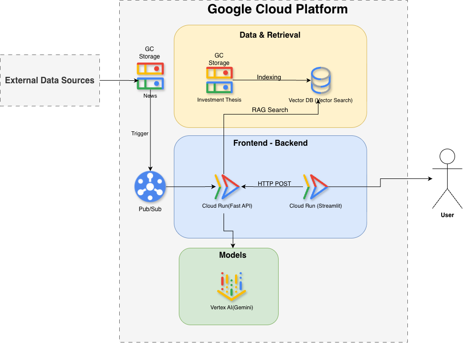
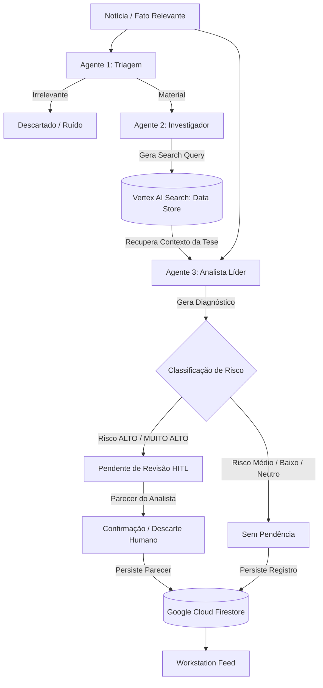

# TAMY - Neo Medallion Thesis Monitor

> _Assistente de IA que monitora teses de investimento em tempo real, cruzando fatos relevantes e notícias com as premissas cadastradas para detectar divergências estruturais e gerar alertas de risco críticos._

**Desafio de Agentes de IA - Mercado de Capitais** Iniciativa DGCU07 + BDP em parceria com o Google · SMC26 (27 a 29 de outubro)

---

## 👥 Equipe

|Papel|Nome|E-mail GFT|
|---|---|---|
|**Capitão**|Edilson Jesus dos Santos Junior|ennt@gft.com|

**Nome da equipe:** Neo Medallion (gft-smc-2026-equipe-05)

---

## 🎯 O Problema

No mercado de capitais corporativo, Analistas de Equity Research e Gestores de Portfólio gerenciam dezenas de teses de investimento baseadas em premissas complexas (ex: rentabilidade histórica, estratégias de M&A, governança, vantagens competitivas). 

Diariamente, o mercado é bombardeado por centenas de Fatos Relevantes, notícias, relatórios trimestrais e boatos que podem invalidar essas teses silenciosamente. Hoje, a conferência do impacto real de uma notícia frente à tese fundamentalista depende puramente de leitura, interpretação e memória humana do analista, o que frequentemente resulta em reações atrasadas e aumento da exposição ao risco sistêmico.

**Público-alvo:** Asset Managers, Equity Research Analysts (Buy-side e Sell-side) e Gestores de Risco.

---

## 💡 A Solução

O **TAMY - Neo Medallion Thesis Monitor** é um pipeline autônomo baseado em Agentes de Inteligência Artificial desenhado para atuar como um "co-piloto de risco" vigilante. 

O sistema ingere (ou coleta autonomamente via Google Search) o fluxo de notícias do mercado financeiro, identifica ativos mencionados, cruza o texto da notícia diretamente com a documentação da tese de investimento vigente, diagnostica quebras ou reforços estruturais (com base nos pilares da tese) e notifica o gestor imediatamente de forma mastigada, priorizando o risco severo.

### Principais Funcionalidades

- **Triagem Inteligente (Agente 1 - Gemini 2.5 Flash):** Descarta ruídos corporativos e concentra processamento apenas em eventos com materialidade financeira real.
- **Query Generation & RAG Híbrido (Agente 2 - Gemini 2.5 Flash):** Formula queries semânticas altamente específicas para recuperação vetorial no **Google Cloud Vertex AI Search**, com fallback local automático no **ChromaDB**.
- **Auditoria Cruzada e Diagnóstico (Agente 3 - Gemini 2.5 Pro):** Contrasta a notícia com as premissas da tese vigente, extraindo citações literais de ambos os lados e determinando o nível de risco.
- **Search Grounding com Links Reais:** Capacidade de buscar autonomamente notícias e Fatos Relevantes na B3 via Google Search Grounding, extraindo os links oficiais e domínios das fontes jornalísticas (ex: InfoMoney, Valor Econômico, Investing.com) para auditoria e conferência direta pelo analista.
- **Persistência em Nuvem (Google Cloud Firestore):** Registro perene e rastreável de todos os diagnósticos gerados, permitindo histórico compartilhado entre toda a equipe de research.
- **Parecer do Analista (Human-in-the-Loop Seletivo por Risco):** Governança onde a revisão e validação humana pelo analista é acionada exclusivamente nos diagnósticos de risco **ALTO** e **MUITO ALTO** (quebras de tese e riscos materiais). Para diagnósticos de risco médio, baixo ou neutro, o sistema não gera pendência, eliminando ruído operacional e focando a equipe no risco de capital.
- **Frontend Workstation:** Interface Streamlit moderna organizada em abas: **Simulação em Lote** (processamento paralelo com filtros) e **Auditoria Live** (para testar qualquer ativo ou notícia avulsa sob demanda).

---

## 📊 Impacto

- **Eficiência:** Reduz drasticamente (em até 95%) o tempo que o analista gasta "caçando" impactos de notícias em longos documentos de tese.
- **Redução de erros:** Mitiga o erro humano de deixar passar batida uma quebra de premissa crítica por desatenção ao excesso de volume de Fatos Relevantes.
- **Valor para o cliente / negócio:** Reação antecipada em realocações de capital frente a cenários adversos, mitigando drawdowns e preservando a rentabilidade do fundo/portfólio.

---

## 🏗️ Arquitetura



### Fluxo Multi-Agentes (Agentic RAG)



**Descrição do fluxo:** A aplicação segue princípios de Clean Architecture:
1. `src/frontend/app.py`: Interface de Workstation (Streamlit) com abas para simulação e auditoria live, incluindo governança Human-in-the-Loop.
2. `src/api/main.py`: Gateway FastAPI recebe o payload e orquestra a chamada.
3. `src/agents/orchestrator.py`: O "cérebro" utilizando o Google ADK coordena Agentes Especializados (Triagem, Investigador, Analista) consumindo Gemini 2.5 Flash e Pro.
4. `src/data/rag_repository.py`: Repositório RAG utilizando `Vertex AI Search` (Google Cloud Discovery Engine) com fallback automático no ChromaDB.
5. `src/data/firestore_repository.py`: Camada de persistência e governança regulatória no `Google Cloud Firestore` (com backend resiliente em `Google Cloud Storage` no GCP para persistência serverless contínua, histórico de alertas e pareceres Human-in-the-Loop).

---

## ⚙️ Stack Tecnológica

|Camada|Tecnologia|
|---|---|
|Plataforma de IA|Google Cloud Vertex AI / Gemini Enterprise|
|Abordagem|Code (Python + Google Agent Development Kit - ADK)|
|Modelo(s)|Gemini 2.5 Flash e 2.5 Pro (Agentes de Triagem, Investigação e Análise)|
|RAG & Busca|Google Cloud Vertex AI Search (Data Store não estruturado) + ChromaDB (Fallback local)|
|Persistência & Auditoria|Google Cloud Firestore / Cloud Storage (Histórico de alertas e decisões Human-in-the-Loop)|
|Recursos usados|Function Calling, Multi-agentes (Orquestrador, Triagem, Divergência), Google Search Grounding|
|Outras ferramentas|FastAPI (Backend), Streamlit (Workstation UI), Pytest (Testes Unitários e E2E)|

---

## ▶️ Demo

🔗 **Link da demo:** [https://neomedallion-frontend-ykxwctwdea-uc.a.run.app](https://neomedallion-frontend-ykxwctwdea-uc.a.run.app) *(Ambiente Cloud Run - GCP)*

### Como acessar o ambiente em nuvem (Cloud Run)
Devido às políticas corporativas de governança e isolamento de segurança no projeto `gft-brazil-bu-gcp`, o serviço no Cloud Run opera em modo autenticado. Para acessar o serviço online:
```bash
# Conecta a Workstation do Cloud Run na sua porta local via proxy autenticado GCP
gcloud run services proxy neomedallion-frontend --region us-central1 --port 8501
```
Acesse imediatamente no navegador em: `http://localhost:8501`

### Como executar localmente _(se aplicável)_:
Caso prefira rodar a stack completa na máquina local sem dependências externas, utilize o script automatizado que sobe o Backend FastAPI e o Frontend Streamlit em paralelo:

```bash
chmod +x scripts/run_demo.sh
./scripts/run_demo.sh
```
Acesse no navegador em: `http://localhost:8501`

**Credenciais de teste** _(se aplicável)_: Acesso corporativo via token GCP (`gcloud auth application-default login`) no ambiente em nuvem, ou execução autônoma sem autenticação obrigatória no modo local.

### Bateria de Testes Automatizados
Para executar todos os testes unitários e end-to-end (E2E):
```bash
./scripts/run_all_tests.sh
```

---

## 🎥 Vídeo (Pitch + Demo)

🔗 **Link do vídeo:** [`docs/video/demo_pitch.mp4`](docs/video/demo_pitch.mp4) *(Vídeo local no repositório)* · Ver também [`docs/video/link.md`](docs/video/link.md)

⏱️ **Duração:** 12 minutos e 16 segundos

- **Arquivo no repositório:** [`docs/video/demo_pitch.mp4`](docs/video/demo_pitch.mp4) (disponível também em formato original [`docs/video/demo_pitch.mov`](docs/video/demo_pitch.mov))
- **Resolução:** Full HD (1920x1080), Codec H.264
- **Conteúdo:** Apresentação do problema no mercado financeiro, arquitetura técnica do pipeline multi-agentes no GCP, demonstração prática ao vivo da Workstation (simulação em lote, live grounding e governança Human-in-the-Loop com parecer do analista).

---

## 📎 Artefatos Entregáveis

Todos os entregáveis obrigatórios do desafio estão organizados neste repositório conforme a tabela abaixo:

|Entregável|Formato|Onde está|Status|
|---|---|---|---|
|Demo funcional|Link / código|seção [Demo](#▶️-demo) + `/src`|[x]|
|Vídeo (pitch + demo)|Link (MP4/URL)|seção [Vídeo](#🎥-vídeo-pitch--demo) + [`docs/video/`](docs/video/)|[x]|
|One-pager (problema, solução, impacto)|**PDF**|[`docs/one-pager.pdf`](docs/one-pager.pdf)|[x]|
|Diagrama de arquitetura|**PDF** + imagem|[`docs/arquitetura.pdf`](docs/arquitetura.pdf) · [`docs/arquitetura.png`](docs/arquitetura.png)|[x]|
|Apresentação (opcional)|PPT/PDF|[`docs/apresentacao.pptx`](docs/apresentacao.pptx) · [`docs/apresentacao.pdf`](docs/apresentacao.pdf)|[x]|

---

## 📁 Estrutura do Repositório

```
.
├── README.md                  ← este arquivo (o cartão de visita do agente)
│
├── src/                       ← CÓDIGO-FONTE do agente (Clean Architecture)
│   ├── api/                   (Gateways e rotas REST FastAPI)
│   ├── agents/                (Agentes ADK, Prompts e Orquestradores)
│   ├── core/                  (Models Pydantic e Configurações)
│   ├── data/                  (Repositórios RAG Vetorial e Cloud Firestore)
│   ├── frontend/              (Workstation Streamlit)
│   └── requirements.txt       (Dependências do código-fonte)
│
├── data/                      ← DADOS mock / públicos / sintéticos
│   ├── fatos_relevantes/      (Fatos relevantes sintéticos e públicos)
│   └── tese_investimentos/    (Teses fundamentalistas estruturadas)
│
├── docs/                      ← DOCUMENTAÇÃO e artefatos de entrega
│   ├── one-pager.pdf          → PDF: problema, solução e impacto (OBRIGATÓRIO)
│   ├── arquitetura.pdf        → PDF: diagrama da arquitetura (OBRIGATÓRIO p/ Forms)
│   ├── arquitetura.png        → imagem do diagrama (referenciada no README)
│   ├── apresentacao.pptx      → PPT/slides do pitch (opcional)
│   ├── apresentacao.pdf       → versão PDF da apresentação (opcional)
│   ├── video/
│   │   ├── link.md            → arquivo texto com o LINK do vídeo
│   │   ├── demo_pitch.mp4     → gravação de demonstração e pitch em MP4
│   │   └── demo_pitch.mov     → gravação em formato original MOV
│   └── imagens/               → diagramas e prints de tela da interface
│
├── scripts/                   ← SCRIPTS utilitários
│   ├── run_demo.sh            (Inicializa backend e frontend em paralelo)
│   ├── run_all_tests.sh       (Executa bateria de testes unitários e E2E)
│   ├── generate_presentation.py (Gerador dos slides de apresentação)
│   └── deploy_gcp.sh          (Deploy serverless no Cloud Run)
│
├── tests/                     ← TESTES automatizados
│   ├── data/                  (Massa de testes sintéticos em JSON)
│   ├── e2e/                   (Testes de integração ponta a ponta na API)
│   └── unit/                  (Testes unitários isolados)
│
├── requirements.txt           ← Dependências gerais do projeto
├── .gitignore                 ← Arquivos ignorados pelo Git
└── LICENSE                    ← Propriedade intelectual da GFT; autoria dos participantes
```

### Onde gravar cada tipo de arquivo

- **Código e prompts** → `src/`. Inclui `requirements.txt` e scripts de setup.
- **Dados** → `data/`. Apenas mock, público ou sintético (sem dados reais ou sensíveis).
- **One-pager** → `docs/one-pager.pdf` (formato PDF).
- **Diagrama de arquitetura** → `docs/arquitetura.pdf` (para o Forms) e `docs/arquitetura.png` para exibição no README.
- **Apresentação / slides** → `docs/apresentacao.pptx` e `docs/apresentacao.pdf`.
- **Vídeo** → Registrado em `docs/video/link.md` e arquivo `.mp4` incluído em `docs/video/demo_pitch.mp4`.
- **Imagens, prints e diagramas** → `docs/imagens/`.

---

## ✅ Checklist antes de submeter

- [x] README preenchido (campos `[ ]` substituídos, comentários removidos)
- [x] Demo funcional acessível pelo link (Cloud Run + execução local)
- [x] Vídeo (pitch + demo) gravado e linkado em `docs/video/`
- [x] One-pager em **PDF** em `docs/one-pager.pdf`
- [x] Diagrama de arquitetura em **PDF** em `docs/arquitetura.pdf`
- [x] Somente dados mock/públicos/sintéticos no repositório
- [x] Equipe e capitão preenchidos corretamente
- [ ] Formulário de **Submissão do Projeto** enviado (link demo, link vídeo, arquitetura PDF, one-pager PDF)

---

## ☁️ Apêndice: Guia de Acesso e Infraestrutura no GCP

Para governança, isolamento e controle de custos durante o Hackathon, o ambiente Google Cloud (GCP) é dividido em dois projetos:

1. **`prj-gft-br-merc-cap-1` (Projeto de Frontend & IA):** Hospeda instâncias do Gemini Enterprise e aplicações low-code.
2. **`gft-brazil-bu-gcp` (Projeto do Desenvolvedor / Backend):** Ambiente onde criamos os microsserviços Cloud Run, Data Stores do Vertex AI Search, Firestore e Storage que alimentam o agente.

### Autenticação Local (SDK / Terminal)
Para que ferramentas locais se autentiquem no GCP:
```bash
gcloud auth application-default login
gcloud config set project gft-brazil-bu-gcp
```
