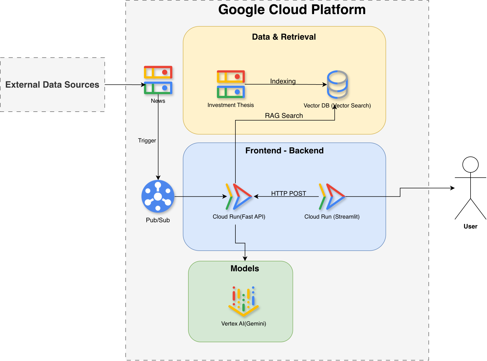
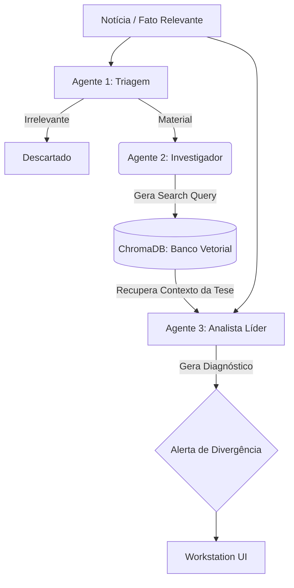

# SMC Thesis Monitor

> _Assistente de IA que monitora teses de investimento em tempo real, cruzando fatos relevantes e notícias com as premissas cadastradas para detectar divergências estruturais e gerar alertas de risco críticos._

**Desafio de Agentes de IA — Mercado de Capitais** Iniciativa DGCU07 + BDP em parceria com o Google · SMC26 (27 a 29 de outubro)

---

## 👥 Equipe

|Papel|Nome|E-mail GFT|
|---|---|---|
|**Capitão**|Edilson Jesus dos Santos Junior|ennt@gft.com|

**Nome da equipe:** Equipe 05 (gft-smc-2026-equipe-05)

---

## 🎯 O Problema

No mercado de capitais corporativo, Analistas de Equity Research e Gestores de Portfólio gerenciam dezenas de teses de investimento baseadas em premissas complexas (ex: rentabilidade histórica, estratégias de M&A, governança, vantagens competitivas). 

Diariamente, o mercado é bombardeado por centenas de Fatos Relevantes, notícias, relatórios trimestrais e boatos que podem invalidar essas teses silenciosamente. Hoje, a conferência do impacto real de uma notícia frente à tese fundamentalista depende puramente de leitura, interpretação e memória humana do analista, o que frequentemente resulta em reações atrasadas e aumento da exposição ao risco sistêmico.

**Público-alvo:** Asset Managers, Equity Research Analysts (Buy-side e Sell-side) e Gestores de Risco.

---

## 💡 A Solução

O **SMC Thesis Monitor** é um pipeline autônomo baseado em Agentes de Inteligência Artificial desenhado para atuar como um "co-piloto de risco" vigilante. 

O sistema ingere (ou coleta autonomamente via Google Search) o fluxo de notícias do mercado financeiro, identifica ativos mencionados, cruza o texto da notícia diretamente com a documentação da tese de investimento vigente, diagnostica quebras ou reforços estruturais (com base nos pilares da tese) e notifica o gestor imediatamente de forma mastigada, priorizando o risco severo.

### Principais Funcionalidades

- **Triagem Inteligente:** O agente principal descarta "ruídos" (notícias irrelevantes) e concentra recursos computacionais apenas em eventos com materialidade financeira.
- **Auditoria Cruzada (Tese vs Notícia):** O agente especialista lê o banco de dados interno de teses (Mock) e contrasta com o texto da notícia em tempo real, extraindo citações exatas de ambos os lados.
- **Search Grounding Integrado:** Capacidade de buscar autonomamente informações adicionais no Google Search para complementar fatos obscuros.
- **Frontend Workstation:** Uma interface Streamlit limpa (focada em auditoria e simulação em tempo real), que permite ao gestor revisar visualmente os alertas com severidades coloridas e evidências lado a lado.

---

## 📊 Impacto

- **Eficiência:** Reduz drasticamente (em até 95%) o tempo que o analista gasta "caçando" impactos de notícias em longos documentos de tese.
- **Redução de erros:** Mitiga o erro humano de deixar passar batida uma quebra de premissa crítica por desatenção ao excesso de volume de Fatos Relevantes.
- **Valor para o negócio:** Reação antecipada em realocações de capital frente a cenários adversos, preservando a rentabilidade do fundo/portfólio.

---

## 🏗️ Arquitetura



### Fluxo Multi-Agentes (Agentic RAG)



**Descrição do fluxo:** A aplicação segue princípios de Clean Architecture. 
1. `src/frontend/app.py`: Interface de Workstation (Streamlit) envia notícias para análise.
2. `src/api/main.py`: Gateway FastAPI recebe o payload e orquestra a chamada.
3. `src/agents/orchestrator.py`: O "cérebro" utilizando o Google ADK coordena Agentes Especializados (Triagem, Investigador, Analista) consumindo Gemini 2.5 Flash e Pro.
4. `src/data/rag_repository.py`: Repositório RAG utilizando `ChromaDB` para indexação vetorial e recuperação inteligente de chunks dos PDFs/Mock Theses.

---

## ⚙️ Stack Tecnológica

|Camada|Tecnologia|
|---|---|
|Plataforma de IA|Google Cloud Vertex AI|
|Abordagem|Code (Python + Google Agent Development Kit - ADK)|
|Modelo(s)|Gemini 1.5 Flash (alta velocidade para triagem e análise)|
|Recursos usados|Function Calling, Multi-agentes (Orquestrador, Triagem, Divergência), Google Search Grounding|
|Outras ferramentas|FastAPI (Backend), Streamlit (Workstation UI), Pytest (Testes Unitários e E2E)|

---

## ▶️ Demo

🔗 **Link da demo:** [Sistema local no computador (Simulador E2E construído)]

**Como executar localmente** _(Recomendado)_:

A aplicação possui um orquestrador que sobe o Backend e o Frontend paralelamente. No terminal, execute:

```bash
chmod +x run_demo.sh
./run_demo.sh
```

Acesse no navegador através de: `http://localhost:8501`

**Como rodar a bateria de testes exaustivos:**
```bash
./run_all_tests.sh
```

---

## 🎥 Vídeo (Pitch + Demo)

🔗 **Link do vídeo:** [A SER PREENCHIDO PELO CAPITÃO]

⏱️ Duração: [A SER PREENCHIDO]

---

## 📎 Artefatos Entregáveis

|Entregável|Formato|Onde está|Status|
|---|---|---|---|
|Demo funcional|Link / código|`/src` e `run_demo.sh`|[x]|
|Vídeo (pitch + demo)|Link (MP4/URL)|`/docs/video/`|[ ]|
|One-pager (problema, solução, impacto)|**PDF**|`/docs/one-pager.pdf`|[ ]|
|Diagrama de arquitetura|**PDF** + imagem|`/docs/arquitetura.pdf` · `/docs/arquitetura.png`|[x]|
|Apresentação (opcional)|PPT/PDF|`/docs/apresentacao.pptx`|[ ]|

---

## 📁 Estrutura do Repositório

```
.
├── README.md                  ← cartão de visita do agente
│
├── src/                       ← CÓDIGO-FONTE do agente (Clean Architecture)
│   ├── api/                   (Gateways e rotas REST)
│   ├── agents/                (Agentes ADK, Prompts e Orquestradores)
│   ├── core/                  (Models Pydantic e Configurações)
│   ├── data/                  (Repositórios Mock)
│   ├── frontend/              (Workstation Streamlit)
│   └── requirements.txt       (Dependências)
│
├── tests/                     ← TESTES
│   ├── data/                  (JSON com massa de dados para simulação)
│   ├── e2e/                   (Testes exaustivos na API real)
│   └── unit/                  (Testes isolados)
│
├── data/                      ← DADOS públicos (PDFs de teses / relatórios base)
│
├── docs/                      ← DOCUMENTAÇÃO e artefatos de entrega
│   └── imagens/                  → prints de tela
│
└── LICENSE                    ← propriedade intelectual da GFT; autoria dos participantes
```
